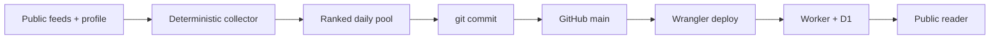

# AI Signal on Cloudflare Workers

AI Signal is a D1-backed daily AI briefing and reader deployed as one Cloudflare Worker. It serves the latest edition at `/`, history at `/history`, and an unlinked owner surface at `/admin`. Editorial data is stored as validated JSON rather than generated HTML.

Live reader: [signal.tamirlevin.dev](https://signal.tamirlevin.dev/)

## Repository and deployment flow

The repository is the durable source of truth for code, configuration, operating rules, and consequential history. Commit and push reviewed source before deploying it, then verify the Worker and D1 state against that Git SHA.



See [PROJECT_HISTORY.md](PROJECT_HISTORY.md) for decisions, incidents, production evidence, and the ranked enhancement queue. Agent sessions cold-boot from [AGENTS.md](AGENTS.md); chat history, handoffs, and agent memory are hints until verified.

The compatibility date is pinned to `2026-08-11`. Move it forward only with a tested Wrangler/workerd update.

## Daily edition pipeline

Every run targets the current `Australia/Melbourne` calendar day. A normal refresh is idempotent for that date, so a repeated run skips after a successful edition already exists.

The code-defined `core-ai` source pack v7 checks:

- AInews, TLDR AI, AlphaSignal, AI Secret, and MTS Situations as equal editorial discovery inputs;
- AI Brief (daily runs API) as an equal discovery input carrying pre-triaged community signal (Hacker News, InfoQ, practitioner blogs);
- Cloudflare Agents as a narrow primary-evidence lane; and
- future feeds under the same timestamp, evidence, and ranking rules—never through source seniority.

The collector then:

1. Parses each source independently. One failed or quiet feed does not block usable candidates from another. TLDR recruitment/promotional entries are excluded using headline labels, summary calls to action, and recruitment destinations before ranking; editorial discussion of jobs or hiring remains eligible.
2. Qualifies and deduplicates the normal 48-hour pool. If fewer than 10 candidates qualify, expands once to 72 hours using the same collected inputs and eligibility rules. Items inside 36 hours receive a small freshness preference, tapering to zero at 48 hours; older fallback items receive no freshness boost. Nothing older than 72 hours is eligible.
3. Requires a usable non-social HTTPS evidence URL. X/Twitter is not collected as a source, cannot become a published card, and does not count as corroboration.
4. Merges duplicate URLs, fuzzy-title matches, and product-version matches into one cluster.
5. Ranks clusters by profile fit, freshness, evidence quality, and capped independent editorial corroboration. Agreement is discovery context, never proof.
6. Applies only a gentle diversity tie-break: when adjacent candidates are within four points, a different lead source may move ahead. There are no source quotas or per-feed publication caps.
7. Keeps at most 18 model candidates and publishes at most 14 cards. Weak candidates never fill a target; a quiet day remains quiet.

The deterministic collector creates the story inventory, Hot Topics, source URLs, provenance, and individual signal dates. Workers AI receives only that bounded inventory and writes presentation copy plus cross-story synthesis. The model cannot add stories or URLs. Every generated edition is validated against the collector's permitted URL catalogue before D1 is changed.

AI Secret uses its full-content [Daily Rundown RSS](https://aisecret.us/tag/daily-rundown/rss/) in one bounded request, with no article crawling or extra model call. It parses up to six recent editions and 24 linked news items per edition from the factual “What's happening” paragraphs and Daily TL;DR lists. Sponsor blocks, recruitment promotions, images, commentary-only links, and unrecognized essay layouts are excluded. RSS publication dates represent reporting dates, not independently verified event dates. Empty/unrecognized output degrades this source report without blocking other sources. Shared feed downloads enforce byte limits while streaming.

AlphaSignal uses its small Google News sitemap rather than its unbounded historical sitemap. The collector reads `news:publication_date` and `news:title`, retains `lastmod` and URL-title parsing only for legacy compatibility, and enriches at most eight recent articles in parallel. Sitemap, parse, and individual enrichment errors are labelled separately; there is no retry on the daily critical path.

MTS Situations uses its public JSON briefing in one bounded request, with no article crawling or extra model call. Only `confirmed`/`developing` stories with a usable non-social evidence link become candidates; X-only stories are excluded under the unchanged no-X-cards rule. Lifecycle, timestamp, and evidence filtering happen before ranking; empty or unrecognized output degrades this source report without blocking other sources.

Immediately before storage, one best-effort editorial QA call reviews the finished draft against the same candidate inventory. It can correct presentation and synthesis only; story cards, ranking, dates, profile, and collection metadata stay unchanged. The review looks for leaked drafting notes, promotional content, contradictions, unsupported claims, and story/citation mismatches. Corrections must pass the existing validation without automatic source substitution. This is an evidence-consistency check, not independent fact verification.

The issue header is the edition date, not a source date. Each signal retains its feed publication date. Historical AInews-base editions remain readable under backward-compatible validation.

## Failure and observability behavior

- A source failure degrades the source report but does not fail a run when other qualified candidates remain.
- If no qualified candidate exists even inside 72 hours, the run fails without publishing an empty or padded edition; the last good edition remains live. Ten is the expansion threshold, not a guaranteed minimum or a new publication cap.
- Editorial generation makes at most one call to each configured model: `@cf/openai/gpt-oss-120b`, then non-reasoning `@cf/meta/llama-3.3-70b-instruct-fp8-fast`, then paid `@cf/moonshotai/kimi-k2.6`. Timeouts, invalid JSON, validation failures, and output-length stops switch models immediately rather than repeating the same request.
- Reasoning models receive a 6,000-token completion allowance; Llama receives a 3,200-token non-reasoning allowance. If all three calls fail, conservative deterministic framing is built from the already validated collector inventory so a healthy source run can still publish without model-authored claims or URLs.
- Each completed run stores a bounded JSON audit of its attempts, including model, outcome, duration, finish reason, completion/reasoning tokens, and response length when available. Output-length exhaustion is classified separately as `MODEL_OUTPUT_TRUNCATED`.
- Editorial QA adds at most one separate call to the configured Llama fallback model, with a 3,200-token allowance and 20-second waiting limit, after either model or deterministic framing succeeds. There are no QA retries. Invalid corrections, provider errors, or timeout publish the original validated draft with a warning; a cheap leaked-note check also flags unresolved internal copy. The waiting limit does not cancel provider inference. Skipped daily runs do not invoke QA.
- QA outcomes (`passed`, `corrected`, or `fallback`), bounded unresolved warnings, model, issue URL, and duration appear in existing Worker logs under `ai-signal editorial QA`, separately from the D1 generation-attempt audit. Card-level concerns are warnings only, never automatic removals. No extra schedule, notification service, or database migration is involved.
- Failed runs are audit records only and cannot replace the last good edition.
- The legacy D1 table `supplemental_shadow_runs` and endpoint `GET /api/shadow/latest` carry the latest source report. `report.mode="daily-pool"` records transport/parser health separately from candidate yield. Each source has a compact accepted → in-window → qualified → selected funnel, with outside-window, missing-evidence, weak-fit, merge, and ranked-out counts. The report also records the actual 48- or 72-hour window, eligible counts, and selected candidates. The edition's coverage label and `collection.maxFreshnessHours` reflect the same window. The reader has no separate fresh-signals section.
- Every selected candidate is accounted before publication: published cards, recorded merges (`duplicate-url`, `duplicate-title`, `duplicate-text`, `product-version` with the surviving target), or invalid rejections with reasons. Any other loss throws a coverage gap that fails the run loudly instead of publishing silently; the decision record is logged per run.
- `TRIAGE_SHADOW_ENABLED=true` adds the advisory reranker judge (full-precision raw scores, weighted maximum over per-interest queries, winning interest logged) without gating anything. `JEV_SHADOW_ENABLED=true` (requires the `TYPESAFE_API_KEY` secret) adds the advisory Jev judge in the same shadow runs: an interest choice over reader interests plus watching topics, pre-today novelty, and substantive scoring, each with confidence. Rows where Jev and the gates disagree are decided by the owner in `/admin`; verdict snapshots and the sided-with-Jev/confident-miss stats drive the fixed promotion rule for replacing the taste gate.
- `GET /api/status` separates the latest run outcome from the latest completed cron heartbeat. The reader alerts after 26 hours without a completed cron check; a timely idempotent skip is a healthy heartbeat.

`SUPPLEMENTAL_SHADOW_ENABLED=true` keeps the read-only source report refreshed when a same-day edition causes generation to skip. It does not create another publication path.

## Reader, profiles, and privacy

AI Signal ships with Profile v2 as its empty-database default; the active production profile can advance independently in D1. The reader shows seven stories by default and allows up to 14 qualified cards without padding.

Production profile v7 retains v6's 14-story budget and other preferences, with coding craft at 3, new systems at 3, and research at 2. These are ranking weights, not category quotas. Read `/api/profile` for current truth; historical editions retain their own profile snapshot.

`Personalise` stores sparse ranking overrides in the current browser only. Tuning links carry preferences in the URL fragment and remain previews until explicitly accepted. Synthesis stays shared while Hot Topics and All Signals can be re-ranked locally.

`/admin` is absent from public navigation. `PUT /api/profile`, `POST /api/refresh`, and `GET /api/visits` require `ADMIN_TOKEN`. The token is used for one request and is never stored by the browser. The optional `POST /api/refresh?republish=1` replaces today's edition and is limited to one successful owner-initiated republish per Melbourne day; failed attempts release the claim.

The public reader records at most one anonymous browser/day visit in D1 with an opaque key, UTC day, path, timestamp, and Cloudflare-provided coarse location. It does not store raw IP addresses, names, clicks, or reading time. Entries are retained for 30 days.

## Local setup

```bash
npm install
npm run types
cp .dev.vars.example .dev.vars
npm run dev
```

Run `npm install` independently on every machine. `node_modules` contains architecture-specific `workerd` and test-runner binaries and is not portable between Intel and Apple Silicon Macs, even when the checkout itself is synchronized through Dropbox.

Create the ignored `.dev.vars` with `ADMIN_TOKEN`. For a new local D1 database:

```bash
npx wrangler d1 create ai-signal
npx wrangler d1 migrations apply ai-signal --local
```

No provider API key is stored. `AI_GATEWAY_ID` may name an existing Workers AI gateway; leave it empty to call the binding directly.

## Verification and deployment

Before a code or configuration release:

```bash
npm run check
npm run dry-run
git diff --check
```

Then follow [AGENTS.md](AGENTS.md): push the reviewed commit to `main`, record the current deployment as rollback evidence, deploy with strict configuration and Git provenance, verify public and D1 state, and record consequential evidence in [PROJECT_HISTORY.md](PROJECT_HISTORY.md). No D1 migration is needed for the v7 pool; historical 48-hour and legacy editions remain readable.

The bounded September 2026 profile experiment is reproducible with `npm run replay:ai-secret -- 2026-09-09` (optional `--details` or `--live-pool`). It reads the currently available feed and public profile, records their identity, and compares ten 08:15 AEST snapshots. It makes no model calls, D1 writes, or publications. This is not an immutable archive or a historical reconstruction of all sources; results change as the feed/profile changes. The optional live-pool comparison collects current sources only.

The configured cron is `15 22 * * *` UTC: 08:15 Melbourne during AEST and 09:15 during AEDT. Cloudflare cron has no Melbourne timezone setting.

## Staging environment

`env.staging` in `wrangler.jsonc` deploys the same worker to `testsignal.tamirlevin.dev` with its own D1 database (`ai-signal-staging`), its own `ADMIN_TOKEN` secret, and an 8-hour test schedule (`15 */8 * * *` UTC) instead of the daily production cron:

```bash
npx wrangler deploy --env staging --tag git-<short-sha>-staging --message "Git <full-sha>; <summary>"
```

Staging exists so experiment branches run against real Cloudflare egress without touching production data, schedule, or spend: the 8-hour cadence yields same-day idempotent skips plus fresh shadow/funnel reads, and any extra generation is an explicit owner `POST /api/refresh`. `ENVIRONMENT=staging` unlocks the `/__scheduled`, `/__shadow`, and `/__jev-probe` test routes. Promote to production only by merging to `main` and following the release rules in [AGENTS.md](AGENTS.md).

## API

Public same-origin endpoints:

- `GET /api/health`
- `GET /api/status`
- `GET /api/editions`
- `GET /api/editions/latest`
- `GET /api/editions/:YYYY-MM-DD`
- `GET /api/profile`
- `GET /api/shadow/latest`

Owner-only endpoints:

- `POST /api/refresh` (normal daily generation; add `?republish=1` only for the guarded replacement path)
- `PUT /api/profile`
- `GET /api/visits?limit=50`
- `GET /api/jev-disagreements` (open Jev/gate disagreements from the latest shadow run)
- `POST /api/jev-verdicts` (`{ story_url, verdict: 1 | -1 }`, snapshotted server-side)
- `GET /api/jev-verdicts/stats` (sided-with-Jev share and confident-reject misses)

All API responses use security headers and do not enable cross-origin access. The Worker is attached only to `signal.tamirlevin.dev`; `workers.dev` is disabled.

## Tests

`npm test` covers source-pack policy, feed parsers, conditional 48/72-hour windows and their boundaries, source-402 fail-open generation, X exclusion, equal-source clustering, corroboration, gentle diversity, no quotas/no padding, candidate merge-decision accounting and coverage enforcement, AI Brief parsing, Jev shadow scoring, owner-verdict agreement stats, trusted-link validation, daily idempotency, guarded republishing, model repair/fallback, one-pass editorial QA correction and fail-open paths, heartbeat aging, API authentication, visit privacy, and preservation of the last good edition under total source failure.
