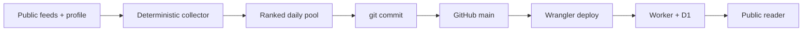

# AI Signal on Cloudflare Workers

AI Signal is a D1-backed daily AI briefing and reader deployed as one Cloudflare Worker. It serves the latest edition at `/`, history at `/history`, and an unlinked owner surface at `/admin`. Editorial data is stored as validated JSON rather than generated HTML.

Live reader: [signal.tamirlevin.dev](https://signal.tamirlevin.dev/)

## Repository and deployment flow

The repository is the durable source of truth for code, configuration, operating rules, and consequential history. Commit and push reviewed source before deploying it, then verify the Worker and D1 state against that Git SHA.



See [PROJECT_HISTORY.md](PROJECT_HISTORY.md) for decisions, incidents, production evidence, and the ranked enhancement queue. Agent sessions cold-boot from [AGENTS.md](AGENTS.md); chat history, handoffs, and agent memory are hints until verified.

The compatibility date is pinned to `2026-08-11`. Move it forward only with a tested Wrangler/workerd update.

## Daily edition pipeline

Every run targets the current `Australia/Melbourne` calendar day. A normal refresh is idempotent for that date, so a repeated run skips after a successful edition already exists.

The code-defined `core-ai` source pack v2 checks:

- AInews, TLDR AI, and AlphaSignal as equal editorial discovery inputs;
- Cloudflare Agents as a narrow primary-evidence lane; and
- future feeds under the same timestamp, evidence, and ranking rules—never through source seniority.

The collector then:

1. Parses each source independently. One failed or quiet feed does not block usable candidates from another.
2. Rejects candidates older than 48 hours. Items inside 36 hours receive a small freshness preference; the final 12 hours taper to zero freshness boost.
3. Requires a usable non-social HTTPS evidence URL. X/Twitter is not collected as a source, cannot become a published card, and does not count as corroboration.
4. Merges duplicate URLs, fuzzy-title matches, and product-version matches into one cluster.
5. Ranks clusters by profile fit, freshness, evidence quality, and capped independent editorial corroboration. Agreement is discovery context, never proof.
6. Applies only a gentle diversity tie-break: when adjacent candidates are within four points, a different lead source may move ahead. There are no source quotas or per-feed publication caps.
7. Keeps at most 18 model candidates and publishes at most 14 cards. Weak candidates never fill a target; a quiet day remains quiet.

The deterministic collector creates the story inventory, Hot Topics, source URLs, provenance, and individual signal dates. Workers AI receives only that bounded inventory and writes presentation copy plus cross-story synthesis. The model cannot add stories or URLs. Every generated edition is validated against the collector's permitted URL catalogue before D1 is changed.

The issue header is the edition date, not a source date. Each signal retains its feed publication date. Historical AInews-base editions remain readable under backward-compatible validation.

## Failure and observability behavior

- A source failure degrades the source report but does not fail a run when other qualified candidates remain.
- If no qualified candidate exists inside 48 hours, the run fails without publishing an empty or padded edition; the last good edition remains live.
- Editorial generation makes at most one call to each configured model: `@cf/openai/gpt-oss-120b`, then non-reasoning `@cf/meta/llama-3.3-70b-instruct-fp8-fast`, then paid `@cf/moonshotai/kimi-k2.6`. Timeouts, invalid JSON, validation failures, and output-length stops switch models immediately rather than repeating the same request.
- Reasoning models receive a 6,000-token completion allowance; Llama receives a 3,200-token non-reasoning allowance. If all three calls fail, conservative deterministic framing is built from the already validated collector inventory so a healthy source run can still publish without model-authored claims or URLs.
- Each completed run stores a bounded JSON audit of its attempts, including model, outcome, duration, finish reason, completion/reasoning tokens, and response length when available. Output-length exhaustion is classified separately as `MODEL_OUTPUT_TRUNCATED`.
- Failed runs are audit records only and cannot replace the last good edition.
- The legacy D1 table `supplemental_shadow_runs` and endpoint `GET /api/shadow/latest` now carry the latest source report. `report.mode="daily-pool"` records source health, the 36/48-hour policy, eligible counts, and selected candidates. The reader no longer renders a separate fresh-signals section.
- `GET /api/status` separates the latest run outcome from the latest completed cron heartbeat. The reader alerts after 26 hours without a completed cron check; a timely idempotent skip is a healthy heartbeat.

`SUPPLEMENTAL_SHADOW_ENABLED=true` keeps the read-only source report refreshed when a same-day edition causes generation to skip. It does not create another publication path.

## Reader, profiles, and privacy

AI Signal ships with Profile v2 as its empty-database default; the active production profile can advance independently in D1. The reader shows seven stories by default and allows up to 14 qualified cards without padding.

`Personalise` stores sparse ranking overrides in the current browser only. Tuning links carry preferences in the URL fragment and remain previews until explicitly accepted. Synthesis stays shared while Hot Topics and All Signals can be re-ranked locally.

`/admin` is absent from public navigation. `PUT /api/profile`, `POST /api/refresh`, and `GET /api/visits` require `ADMIN_TOKEN`. The token is used for one request and is never stored by the browser. The optional `POST /api/refresh?republish=1` replaces today's edition and is limited to one successful owner-initiated republish per Melbourne day; failed attempts release the claim.

The public reader records at most one anonymous browser/day visit in D1 with an opaque key, UTC day, path, timestamp, and Cloudflare-provided coarse location. It does not store raw IP addresses, names, clicks, or reading time. Entries are retained for 30 days.

## Local setup

```bash
npm install
npm run types
cp .dev.vars.example .dev.vars
npm run dev
```

Run `npm install` independently on every machine. `node_modules` contains architecture-specific `workerd` and test-runner binaries and is not portable between Intel and Apple Silicon Macs, even when the checkout itself is synchronized through Dropbox.

Create the ignored `.dev.vars` with `ADMIN_TOKEN`. For a new local D1 database:

```bash
npx wrangler d1 create ai-signal
npx wrangler d1 migrations apply ai-signal --local
```

No provider API key is stored. `AI_GATEWAY_ID` may name an existing Workers AI gateway; leave it empty to call the binding directly.

## Verification and deployment

Before a code or configuration release:

```bash
npm run check
npm run dry-run
git diff --check
```

Then follow [AGENTS.md](AGENTS.md): push the reviewed commit to `main`, record the current deployment as rollback evidence, deploy with strict configuration and Git provenance, verify public and D1 state, and record consequential evidence in [PROJECT_HISTORY.md](PROJECT_HISTORY.md). No D1 migration is needed for the v2 pool because edition collection/provenance metadata remains optional and backward compatible.

The configured cron is `15 22 * * *` UTC: 08:15 Melbourne during AEST and 09:15 during AEDT. Cloudflare cron has no Melbourne timezone setting.

## API

Public same-origin endpoints:

- `GET /api/health`
- `GET /api/status`
- `GET /api/editions`
- `GET /api/editions/latest`
- `GET /api/editions/:YYYY-MM-DD`
- `GET /api/profile`
- `GET /api/shadow/latest`

Owner-only endpoints:

- `POST /api/refresh` (normal daily generation; add `?republish=1` only for the guarded replacement path)
- `PUT /api/profile`
- `GET /api/visits?limit=50`

All API responses use security headers and do not enable cross-origin access. The Worker is attached only to `signal.tamirlevin.dev`; `workers.dev` is disabled.

## Tests

`npm test` covers source-pack policy, feed parsers, the 36/48-hour window, X exclusion, equal-source clustering, corroboration, gentle diversity, no quotas/no padding, trusted-link validation, daily idempotency, guarded republishing, model repair/fallback, heartbeat aging, API authentication, visit privacy, and preservation of the last good edition under total source failure.
