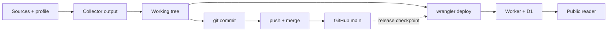

# AI Signal on Cloudflare Workers

A standalone Cloudflare Worker and D1-backed reader for AI Signal. It presents a static, wide desktop-first reader at `/`, a distinct `/history` route, an unlinked owner surface at `/admin`, and keeps editorial data as one JSON edition instead of generating HTML per issue.

Live reader: [signal.tamirlevin.dev](https://signal.tamirlevin.dev/)

## Repository and deployment flow

The same working tree feeds two separate records: Cloudflare runtime deployment and Git source snapshot. Keep them aligned by committing and merging the reviewed state before deploying, then verify the live Worker.



See the [interactive flow diagram](docs/architecture/ai-signal-repo-flow.html) for the same model with the historical drift point highlighted.

See [PROJECT_HISTORY.md](PROJECT_HISTORY.md) for the curated engineering decisions, production incidents, and pending verification behind that flow.

Agent sessions should cold-boot from [AGENTS.md](AGENTS.md). It defines the source hierarchy, verification steps, authorization boundaries, and release discipline. Chat history, handoffs, and agent memory are disposable context rather than project authority. If an agent does not automatically discover the file, tell it: “Read `AGENTS.md`, cold-boot from the repository, verify Git and any relevant live state, then propose a plan before changing anything.”

The compatibility date is pinned to `2026-08-11`. Move it forward with a tested Wrangler/workerd update.

## What it does

- Fetches the newest item in `https://news.smol.ai/rss.xml` as the base issue, then (when blending is enabled) samples the newest TLDR AI issue, up to five enriched AlphaSignal discoveries from a 72-hour source window (falling back to the newest available item when AlphaSignal is quiet), and recent Cloudflare Agents posts.
- Uses the versioned `core-ai` source pack (v1) to keep public feeds, source roles, lookback windows, and shadow caps explicit and reusable for future team profiles.
- Treats AlphaSignal and TLDR AI as trusted editorial discovery, AInews as the independent base/cross-check and coverage layer, and the narrow Cloudflare feed as known primary evidence. Newsletter agreement is recorded as editorial corroboration, never as proof.
- Decodes the AInews issue HTML, captures its exact direct `href` values, and admits a supplemental URL only when it is a usable HTTPS linked/primary source. A linked source is supplied by the feed but not independently verified; primary status is reserved for the explicit Cloudflare host allowlist. Aggregator-only, social-profile, tracking, and invalid URLs cannot become novel published stories.
- Rejects an edition if any story, provenance-evidence, or synthesis URL was not supplied by the deterministic collector. The AInews issue URL and publication date remain source-derived.
- Compacts each long issue into an 18-block, profile-aware candidate inventory, retaining priority material plus a diversity sample.
- Builds source-aware clusters, leads, editorial corroboration, evidence metadata, Hot Topics, and individual signal cards deterministically. One cluster becomes at most one source-bound card; Workers AI writes only the cross-story synthesis.
- Uses `@cf/openai/gpt-oss-120b` normally. Invalid primary output gets one repair retry before a one-time switch to `@cf/zai-org/glm-4.7-flash`; a primary timeout switches immediately.
- Ships with AI Signal Profile v2 as its empty-database default: up to 14 qualified candidates without padding, seven stories shown by default, category weights, watched topics, and rare exceptional-story override. Saved D1 profiles advance independently.
- Stores a validated edition JSON plus its profile snapshot in D1. The last 15 successfully published editions are retained; failed runs only create a run record and cannot replace the last good edition.
- Persists sparse personal overrides in the viewer's browser only and applies them to current and historical editions. No name, email, click history, or account is stored.
- Records one anonymous browser/day visit for the public reader routes in D1. The ledger stores an opaque visitor key, UTC day, path, timestamp, and Cloudflare-provided country/region/city when available; it does not store raw IP addresses, names, clicks, or reading time. Entries are retained for 30 days and are available only to the owner through `/api/visits` or the admin panel, including distinct-browser counts.
- Supports portable tuning links in the URL fragment. Imported settings remain a preview until the recipient explicitly accepts them.
- Keeps global profile updates and manual refresh under `/admin`; both mutations still require the owner token, which is used for one request and never persisted by the browser.
- When the AInews anchor has not changed, the latest reader can surface up to five newer qualified candidates already present in the matching shadow report. This compact “Fresh since this edition” section preserves collector order and source links; it does not invoke a model, create an edition, or alter history.

## Personal and global controls

`Personalise` changes only the current browser. It can save, reset, or copy a tuning link; none of those actions call the profile-write API. Each stored edition retains the global profile that generated it. The latest reader applies the active global profile to that stored candidate inventory, while historical edition links retain their original profile snapshot. Synthesis remains the shared editorial view while Hot Topics and All Signals can be personally re-ranked.

`/admin` is deliberately absent from public navigation. Knowing its URL does not grant authority: `PUT /api/profile` and `POST /api/refresh` require `ADMIN_TOKEN`. A saved global profile is used by future generation runs; it does not rewrite stored editions. The admin page also exposes a separate forced republish action (`POST /api/refresh?republish=1`), which replaces the latest issue in place and is limited to one successful republish per Melbourne calendar day. Failed republish attempts release their daily slot so they can be retried.

The reader shows the latest collector outcome, the brief generation time, and the daily scheduled check time. `GET /api/status` also reports whether the latest completed cron heartbeat is healthy, stale, or missing using a 26-hour threshold. Heartbeat freshness is independent of outcome, so a timely idempotent `skipped` run is healthy; a failed run can still be recent while the collector outcome remains visibly failed.

## Blended source policy and rollback

`SUPPLEMENTAL_BLEND_ENABLED=true` enables the source-aware production inventory. AInews remains the base and the complete fallback. The collector:

- canonicalizes URLs, strips tracking parameters, and merges exact-URL, fuzzy-title, and product-version duplicates;
- records one editorial lead, separate editorial cross-checks, and linked/primary evidence for each cluster;
- applies a small capped deterministic coverage boost for distinct editorial sources (AInews, TLDR AI, AlphaSignal); Cloudflare Agents is tracked as primary evidence, and X is never fetched or counted as corroboration;
- prefers known primary evidence, then a usable linked source, while retaining the original AInews links in the permitted source catalogue;
- admits only strong profile-fit novel candidates with usable linked/primary URLs, at most two in total and at most one per lead source;
- preserves the ceilings of 18 model candidates and 14 published stories, with AInews occupying at least 16 slots when the base inventory is full; and
- never fills a story target with weak supplemental material. A quiet source day remains quiet.

“Lead” means the deterministic source selected to frame the cluster; it does not claim that source published or surfaced the story first. Feed timestamps are retained on supplemental candidates for ranking, but are not treated as comparable provenance chronology. When overlapping editorial candidates are otherwise equivalent, the fixed tie-break is AlphaSignal, then TLDR AI; known primary evidence can still win the story link independently.

Supplemental fetch or parsing failures degrade the source report but do not fail generation: the AInews inventory publishes unchanged. Every stored/public card carries optional provenance so the reader can distinguish editorial lead, editorial cross-check, and evidence type. Historical editions without that metadata remain valid.

There is no X collector in this Worker. Existing X links supplied by AInews may remain as linked story URLs, but X is not fetched, counted as editorial corroboration, or treated as primary evidence here.

`SUPPLEMENTAL_SHADOW_ENABLED=true` remains the observation fallback. When blending is disabled—or a run skips because the AInews issue is already published—the isolated shadow collector measures the same feeds without mutating an edition. The legacy `supplemental_shadow_runs` table and `/api/shadow/latest` endpoint now store/return the latest source report; `report.mode` identifies `shadow` versus `blend`.

Production status: blending is enabled in the deployed Worker. Before publishing future changes, run the checks below and inspect a fresh source report. Set `SUPPLEMENTAL_BLEND_ENABLED=false` for an immediate code-free return to AInews-only publication while leaving shadow observation on. No D1 migration is required because provenance and collection policy are backward-compatible optional fields in the edition JSON.

`GET /api/shadow/latest` returns the latest source report, including source health, overlaps with AInews, shadow candidates, and (in blend mode) the novel candidates selected for the publication inventory. The public reader uses only a non-failed report anchored to the displayed latest edition, completed after that edition, and filters its `wouldAdd` list to HTTPS candidates with source timestamps newer than the edition publication time.

## Local setup

```bash
npm install
npm run types
cp .dev.vars.example .dev.vars
npm run dev
```

Create `.dev.vars` locally (it is ignored by Git):

```text
ADMIN_TOKEN=choose-a-long-random-value
```

Create and apply the local D1 schema:

```bash
npx wrangler d1 create ai-signal
# Put the returned database_id into wrangler.jsonc.
npx wrangler d1 migrations apply ai-signal --local
```

`AI_MODEL` defaults to `@cf/openai/gpt-oss-120b`, with `@cf/zai-org/glm-4.7-flash` as a one-time fallback after a timeout or a failed primary repair. Before inference, the collector deterministically ranks and compacts the AInews base, clusters it with gated supplemental discoveries, and selects at most 18 profile-aware candidates while retaining permitted source links. It materializes the story inventory itself; the model receives the ranked source-aware candidates only to produce synthesis and presentation copy. Output is capped at 3,200 tokens and reasoning effort is kept low so reasoning models retain enough budget for the final edition. GPT-OSS uses Workers AI structured JSON mode; GLM receives the same strict JSON contract in the prompt. Empty or truncated model responses are recorded with safe response-shape, finish-reason, and token-count diagnostics, without storing model prose. Set `AI_GATEWAY_ID` to an existing gateway ID to route the Workers AI binding through that gateway; leave it empty to call the binding directly. No provider API key is used or stored.

## Deploy runbook

1. Confirm the `ai-signal` D1 binding and database ID in `wrangler.jsonc` are the intended production database.
2. Apply the migration remotely: `npx wrangler d1 migrations apply ai-signal --remote`.
3. Set the secret: `npx wrangler secret put ADMIN_TOKEN`.
4. Treat `wrangler.jsonc` as the source of truth for non-secret runtime values. Confirm its `AI_GATEWAY_ID`, `AI_MODEL`, and `AI_FALLBACK_MODEL` values before deploying; a Wrangler deployment overwrites dashboard-only variable changes unless `keep_vars` is explicitly enabled.
5. Verify configuration with `npm run types`, `npm run typecheck`, `npm test`, and `npm run dry-run`.
6. Deploy only after review: `npx wrangler deploy`.

The project deliberately has no automatic resource provisioning or deployment command in this repository.

## Schedule and DST

The configured Cloudflare cron is `15 22 * * *` (UTC). It fires at 08:15 in Melbourne during AEST (UTC+10), and at 09:15 during AEDT (UTC+11). Cloudflare cron has no Melbourne timezone setting. D1 idempotency means a manually triggered or repeated run for the same AInews issue is safely skipped. The normal admin refresh keeps that behavior; the separate republish action can replace the current issue once per Melbourne calendar day for post-publication testing.

The scheduled handler performs the fail-open supplemental blend inside generation. It avoids a duplicate shadow fetch after a blended publication, but still runs the isolated shadow collector when the AInews issue is already published. The latest completed `cron` run is the scheduled heartbeat; the reader alerts after 26 hours without one and does not misclassify a normal already-published skip as stale. In non-production local development only, `/__scheduled` is protected by `ADMIN_TOKEN`, and `/__shadow` runs the source experiment without model generation. Production returns 404 for both diagnostic routes.

## API

Public same-origin endpoints:

- `GET /api/health`
- `GET /api/status`
- `GET /api/editions`
- `GET /api/editions/latest`
- `GET /api/editions/:YYYY-MM-DD`
- `GET /api/profile`
- `GET /api/shadow/latest`

Owner-only endpoints (use `Authorization: Bearer <ADMIN_TOKEN>`):

- `POST /api/refresh` (normal refresh; add `?republish=1` for the admin-only once-daily forced republish)
- `PUT /api/profile`
- `GET /api/visits?limit=50` (entries, distinct-browser totals, today's totals, and country/region grouping)

All API responses use security headers and do not set cross-origin CORS permissions. The admin token is never returned or persisted by the UI. The public tuning workflow never sends personal preferences to the Worker.

## Custom domain and rollback

The Worker is attached to `signal.tamirlevin.dev` as a Cloudflare Custom Domain. The public `workers.dev` hostname is disabled; this repository intentionally has one canonical reader URL. Before each production deployment, record the current version with `npx wrangler deployments list`. If a release is unhealthy, restore the prior version with `npx wrangler rollback <version-id> -y`; the D1 migrations are additive and do not require rolling back data.

## Tests

`npm test` covers structured-edition validation, collector-trusted link and provenance enforcement, source-pack/coverage consistency, duplicate-link rejection, first-item RSS parsing, malformed-primary-response fallback orchestration, API authentication, production diagnostic-route blocking, supplemental parser behavior, cross-source overlap/lead/corroboration, primary-link preference, blend caps/no-padding, fresh-shadow reader filtering, scheduled-heartbeat aging, once-daily Melbourne republish claims, and publication isolation under total supplemental failure. `npm run types` generates the Worker binding type definition from `wrangler.jsonc`; do not hand-write `Env`.
